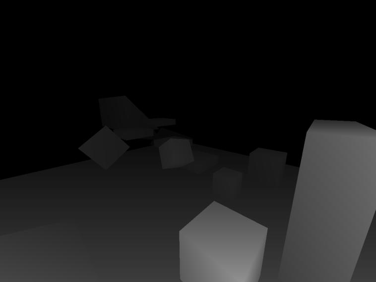
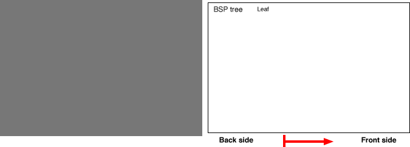
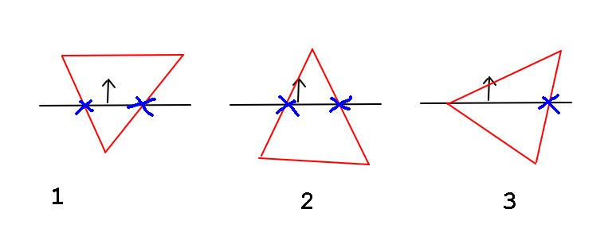
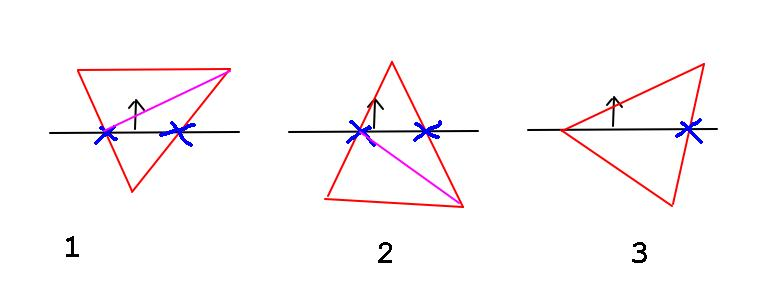

# On the creation of NUKO - Binary Space Partitioning

## INTRODUCTION

NUKO is the cumulative product of the past four or so years of studying game
engine development. It compiles all my knowledge of rendering, physics and
networking into a single wholly completed project.

Perhaps the catalyst for me choosing to pursue this project was finally being
able to write physics in 3D.

Up until then, I had written several demos including 3D graphics using OpenGL,
however, I could only noclip around the geometry I had loaded in. Other games
using 3D graphics I had developed, such as _Aechmea_, hid behind the facade of
3D graphics while actually operating on 2D logic such as the use of a flat grid
for tile collision. As a result, the maps were limited to being flat and blocky.

However, a small demo I had been working on a few months prior aimed to solve
this.

## SEPARATING AXIS THEOREM AND BINARY SPACE PARTITIONING

The inception of what would become NUKO can actually be traced back to almost
two years before its actual creation. It was essentially born out of attempting
to solve collision in a 3D environment.

||
|:--:|
|A screenshot of an early version of NUKO when it was still a 3D collision demo|

NUKO began as a project to test if I could combine Separating Axis Theorem (SAT)
and Binary Space Partitioning (BSP) to create an efficient collision algorithm.

The idea spawned from trying to implement DOOM’s binary space partitioning
rendering algorithm where space was divided into partitions stored in a binary
tree.

A map in DOOM was essentially composed of lines or “segments”. These were
abstracted into planes or “linedefs”, essentially the line but stretching
infinitely. The space was then split in half by a plane into the space in front
of it and the space behind it. This could then be represented in a binary tree
where each node is a plane and its two children are the front and back space.

A tree traversal, such as checking the player’s position, would involve
beginning with a node, checking if the position was below or above the node’s
plane and the corresponding child node would be walked into. This was applied
recursively until an leaf node was reached.

It suddenly clicked to me that, performing a series of plane tests on a position
to determine if it occupied a certain space, was essentially collision.

A general convex hull collision algorithm, Separating Axis Theorem, used a
similar principle – that between two convex hulls, there would be a plane of
separation if they were not colliding, i.e. if the closest vertex to the shape
(position) was in front of any of the hull’s planes, it was not colliding.

With this general idea, I began writing up some of the first iterations of NUKO.

## GENERATING A BSP

Before any collision algorithm could be written however, the BSP itself would
have be generated. This required an algorithm which could turn 3D geometry into
a BSP.

First, the algorithm would have to parse an _.obj_ (the mesh format I was
using), exported from blender. This mesh would already be assumed to be sorted
into its respective objects, faces (converted into triangles) and vertices with
each being a convex hull.

It would then take the first face of the first object and turn it into a plane
and set it as the root node. Then, the next face would be taken and, if all the
vertices were in front of it, it would be in front of the
node. If all the vertices were behind the plane, then the
face will be behind the node.

||
|:--:|
|Animation demonstrating Binary Space Partitioning (Valve, BSP) [1]|

But what if the face was in between the dividing plane? We
would have to split the triangles.

## TRIANGLE SPLITTING

Due to the nature of a triangle, having 3 vertices, there could three cases when
a triangle is split down a plane.

1\. Two vertices are in front of the plane and one is behind

2\. Two vertices are behind the plane and one is ahead

3\. One vertex lies on the plane and the other two are behind or ahead of the
plane

||
|:--:|
|The cases in a triangle split|

As seen in the diagram, two of the cases involve two splitting points while the
third one involves only one. With this, splitting a triangle simply involves
categorising the vertices of the face into ahead, behind or on the plane.

Depending on the numbers behind, ahead or on it, the segments (edge of the
triangle) would be split once or twice by simply representing it as a ray and
finding its intersecting point on the plane.

However, the final problem is that our algorithm can only interpret triangular
faces. This was simply solved by taking the intersecting points as new vertices
and arranging them into new triangles.

||
|:--:|
|The cases in a triangle split|

In the case of when a vertex was on the plane, the resulting polygons are
already triangular and thus do not need to be rearranged.

With this, the map could be decomposed into a binary tree of nodes. The old
vertex data would then be unecessary for spatial computation and can be
discarded.

An object can traverse this tree with a collision detection function which is
able to test any geometry against a plane. If the geometry is above the plane,
traverse the node ahead and vice versa for behind. If the geometry intersects
the plane, traverse both behind and ahead nodes.

## SPHERICAL COLLISION

One of the most basic collision functions we can perform on the BSP is a
spherical collision test.

In terms of geometry, a sphere is a shape which extends uniformly from a single
point. A sphere can be said "to have infinite faces".

This is useful because it means to test a sphere against the plane, which just
shift the plane up and test of the point is still above or below the plane.

To test a sphere against the plane you would simply do:

```
STRUCT Sphere
  Vector3 position
  float   radius
END STRUCT

STRUCT Plane
  Vector3 normal
  float   distance
END STRUCT

FUNCTION CollideSphereAndPlane(Sphere sphere, Plane plane) : CollisionState
  float distance_from_plane = sphere.position.dot(plane.position) - sphere.distance
  
  IF distance_from_plane + 2 * sphere.radius > 0 THEN
    ... THE SPHERE IS ABOVE THE PLANE
  END IF
  
  IF distance_from_plane < 0 THEN
    ... THE SPHERE IS BELOW THE PLANE
  END IF
END FUNCTION
```

Keep in mind, if the sphere is intersecting the plane, in that it's both above
and below the plane, the code will fall through the _above test_ and still run
the _below test_.

To integrate the entire BSP, we simply replace the plane with a node containing
the plane itself and children nodes. In testing the  states above, we travserse
the respective space which the sphere inhabits.

```
...

ENUM BSPNodeType
  BSP_NODE_EMPTY
  BSP_NODE_SOLID
END ENUM

STRUCT BSPNode
  BSPNode     above
  BSPNode     below
  Plane       plane
  BSPNodeType type 
END STRUCT

FUNCTION TestSphereBSP_R(Sphere sphere, BSPNode node)
  float distance_from_plane = sphere.position.dot(plane.position) - sphere.distance
  
  IF distance_from_plane + 2 * sphere.radius > 0 THEN
    TestSphereBSP_R(sphere, plane.ahove)
  END IF
  
  IF distance_from_plane < 0 THEN
    IF node.type == BSP_NODE_SOLID THEN
      ... THE SPHERE IS COLLIDING WITH SOMETHING!
    END IF
    
    TestSphereBSP_R(sphere, plane.below)
  END IF
END FUNCTION
```

In visualising how it works, it can be useful to imagine encasing a sphere in
jelly. Each node traversal is like cutting the jelly along the node's plane. If
the sphere is in both parts of the jelly, we keep going in either. But if a cut
of jelly no longer contains any part of the sphere, we discard it.

In each traversal of the tree, we assume that parts space are culled off.
Therefore if a node is marked as solid, we're essentially saying all space above
it is solid. And therefore, if we pass a node that is marked solid, it is
colliding with something.

## REFERENCES

[\[1\] https://developer.valvesoftware.com/wiki/BSP](https://developer.valvesoftware.com/wiki/BSP)
